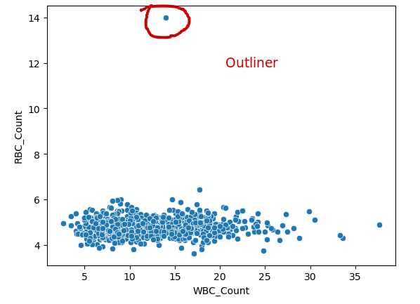
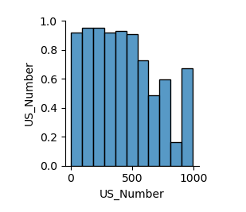

# Assignment 2. Supervised Learning. AI.

## Final Delivery

- David Burchakov (up202203777@edu.fe.up.pt)

#### To run the program, unzip the folder and open through Jupyter Notebook.

## Description
Application of different Machine Learning algorithms, including Nearest Neighbor, SVM, Decision Trees and Neural Networks and a comparison of theese algorithms. The purpose of the project is to find a binary solution for real-life data - Regensburg Pediatric Appendicitis dataset. 
Machine Learning algorithms are taught to identify, whether an entry will have apendicitis or not based on his characteristics.

#### Steps

I. Correct the data
Firstly, the data should be corrected from erroneous data, empty entries or outliners.

Remove outliners

Remove erroneous data
~~~~
# - remove anomally tall babies
rows_to_drop = data[(data['Age'] <= 3.0) & (data['Height'] > 100)].index
dataNew = data.drop(rows_to_drop)

# - remove anomally cold patients
rows_to_drop = dataNew[(dataNew['Body_Temperature'] <= 30)].index
dataNew = dataNew.drop(rows_to_drop)

# - remove anomally big RDW
rows_to_drop = dataNew[(dataNew['RDW'] > 30)].index
dataNew = dataNew.drop(rows_to_drop)

# Remove anomaly heavy children (aged less than 3 years)
rows_to_drop = dataNew[(dataNew['Age'] < 2) & (dataNew['Weight'] > 14.8)].index
dataNew = dataNew.drop(rows_to_drop)
~~~~

Additionally, we remove columns with incremental unique unformation that does not affect the final binary solution

US_number is an incremental unique number of the patient that does not influence having appendicitis or not.

II. Analyse the data
III. Apply Machine Learning Algorithms
